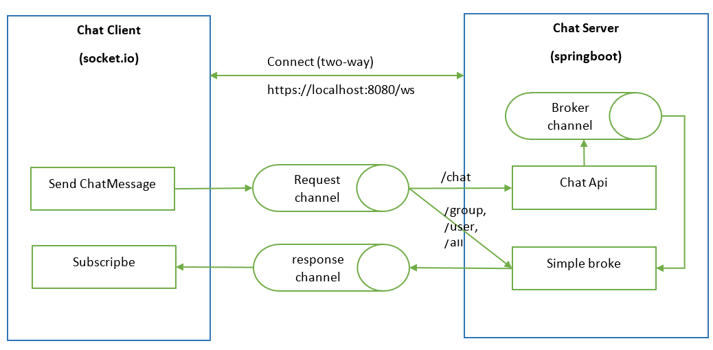

# XEEX BE

チャットアプリケーションのサーバー作成プロジェクト

## 紹介

このプロジェクトは、チャットアプリケーションのためのサーバーを作成し、データの保存、クエリ、管理、およびセキュリティをサポートする役割を果たします。

## 主な技術

- 言語、プラットフォーム：Java 17
- フレームワーク：Spring Boot v3.2.5
- Web socket
- データベース：MySQL DB v.8.3.0

Websocket: use the WebSocket (STOMP socket)


## 環境

- JDK v.17
- VS Code v.1.88.1
  - Java プロジェクトのビルド/実行をサポートするプラグイン（Java Extension Pack をインストール）
  * Debugger for Java
  * Extension Pack for Java
  * Gradle for Java
  * Maven for Java
  * Project Manager for Java
  * Test Runner for Java
  - コードのフォーマットと警告チェックをサポートするプラグイン
  * Sonalint
  * Prettier - Code formatter
- MySQL workbench v.8.0

## ビルド＆実行

- VS Code - ターミナルを使用

* Clean: gradle clean または .\gradlew clean
* Build: gradle build または .\gradlew build
* Run: gradle bootRun または .\gradlew bootRun

## プロジェクト構造
```
main
├─java.co.jp.xeex.chat: システム全体のバックエンドチャットを処理するパッケージ
│ ├─base : ベースクラス
│ ├─common : システム全体の共通定義、定数、エンドポイント API など
│ ├─config : システムの設定、CORS の処理
│ ├─domains  
│ │ ├─admin : 管理者権限
│ │ │ ├─delete
│ │ │ │ └─user
│ │ │ ├─dto
│ │ │ ├─save
│ │ │ │ └─user
│ │ │ └─search
│ │ │ └─user
│ │ ├─auth : ユーザーアカウント関連の処理
│ │ │ ├─changepwd
│ │ │ ├─login
│ │ │ ├─logout
│ │ │ └─refeshtoken
│ │ ├─chat : ソケットの処理、メッセージデータのブロードキャスト、クライアントへの通知
│ │ ├─chatmngr : 必要なデータの CRUD を処理する API
│ │ │ ├─dept
│ │ │ │ ├─dto
│ │ │ │ ├─getmbr
│ │ │ │ └─search
│ │ │ ├─file
│ │ │ │ ├─dto
│ │ │ │ └─save
│ │ │ ├─friend
│ │ │ │ ├─add
│ │ │ │ ├─delete
│ │ │ │ ├─dto
│ │ │ │ ├─getnone
│ │ │ │ └─search
│ │ │ ├─group
│ │ │ │ ├─delete
│ │ │ │ ├─dto
│ │ │ │ ├─getinfo
│ │ │ │ ├─getmbr
│ │ │ │ ├─leave
│ │ │ │ ├─save
│ │ │ │ └─search
│ │ │ ├─groupfriend
│ │ │ │ └─getall
│ │ │ ├─msg
│ │ │ │ ├─dto
│ │ │ │ ├─get
│ │ │ │ └─save
│ │ │ ├─repply
│ │ │ │ ├─get
│ │ │ │ └─mapper
│ │ │ └─thread
│ │ │ ├─dto
│ │ │ └─get
│ │ ├─task : タスク関連の機能を処理
│ │ └─usecase : API テンプレート
│ ├─encryption : 暗号化の処理
│ ├─entity : データベース対応のエンティティ
│ ├─exception : 例外処理のハンドリング
│ ├─lang
│ │ └─resource : 言語ごとのメッセージ処理
│ ├─repository : エンティティに対応するリポジトリ
│ ├─token : トークンの管理、認証された API
│ ├─util : 共通で使用されるクラス
│ └─validation : API の共通バリデーション
├─resources : システムの設定ファイル、言語ごとのメッセージ
└─scripts : スクリプト、バッチファイル、サーバーの実行
```
## サポート

Brycen Vietnam Co., Ltd.
**_Team XEEX_**
TEL：+84 (0)234 6558332
FAX：+84 (0)234 6558332
